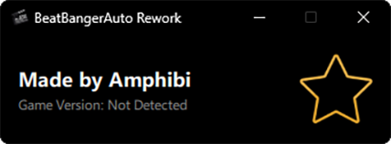

# BeatBangerAuto Rework

### *The Ultimate Hands-Free Experience for Beat Banger*

[Download Latest Release](https://github.com/AmphibiDev/BeatBangerAuto-Rework/releases/latest) | [Report a Bug](https://github.com/AmphibiDev/BeatBangerAuto-Rework/issues)

---

## What is BeatBangerAuto?

BeatBangerAuto is a powerful and one-click autoplay utility that lets you enjoy Beat Banger hands-free on any level or mod — without blocking your after-level rewards.

## Key Features

- **Perfect Accuracy** - Hit every note perfectly
- **Reward Preservation** - Keeps all rewards and progression after each level
- **Universal Compatibility** - Works with any level, including custom mods
- **Multi-Resolution Support** - Works with different screen and game resolutions
- **Difficulty Modes Support** - Compatible with fast notes, disappearing notes, and all in-game modes
- **Auto-Updates** - Downloads latest configs from GitHub automatically
- **Pattern Scanning** - Uses advanced memory scanning, no manual updates needed
- **One-Click Activation** - Simple interface for instant autoplay

## Installation & Usage

### Quick Start

1. **Download** the latest version from [Releases](https://github.com/AmphibiDev/BeatBangerAuto-Rework/releases/latest)
2. **Launch** Beat Banger (if not already running)
3. **Run** `BeatBangerAuto.exe`
4. **Click** the large star button on the right
5. **Wait** until you see the text: `Autoplay is active`
6. **Select** your desired level in-game
7. **Enjoy**!

## Supported Versions

BeatBangerAuto Rework supports **LEGACY and RELEASE game versions** and continues to work with the latest updates.

For a complete list of tested versions, check the [supported versions sheet](https://docs.google.com/spreadsheets/d/e/2PACX-1vRdfOn-dYrf2Dup2ROyMIACQeno5k1aMsItb5RdtueNqjJVRv209OaGDlvkP1J2jBoUzf1x4eBTvoB3/pubhtml).

## Configuration

The application automatically downloads and applies the latest configuration from the GitHub repository. No manual configuration is required!

If you want to customize or add patterns yourself:
- Config file is stored in the application directory
- Modify `config.json` for different game patches
- Restart the application to apply changes

## Troubleshooting

Common Issues & Solutions

### "Autoplay is not working"
- Ensure that multiple instances of Beat Banger are not running
- Try running as Administrator
- Check if your antivirus is blocking the application

---

⭐ If you find this useful, please star the repository!

